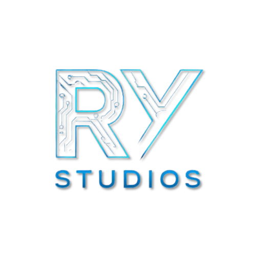

<div align="center">
  
</div>

---

<div align="center">

◈ AI/ML Engineer @ Tata Consultancy Services ◈ RyStudios Founder
<br/>
Hyderabad, India &nbsp;·&nbsp; [LinkedIn](https://linkedin.com/in/yat-hik-1b93a8268) &nbsp;·&nbsp; [Portfolio](https://rystudios-iris.vercel.app)

</div>

---

## ◆ About Me
```python
yathik = {
    "role"        : "AI/ML Engineer @ Tata Consultancy Services",
    "experience"  : "2.5+ years",
    "domain"      : "Healthcare AI CoE | Agentic & GenAI Systems",
    "focus"       : [
                     "Agentic AI", "LLMs", "RAG/CAG",
                     "MCP", "LangGraph", "LLMOps"
                    ],
    "achievement" : "TCS AI Hackathon Winner — Sep 2025",
    "awards"      : [
                     "OnTheSpot Award — TCS Gems Jul 2025",
                     "Silent Soldier Award — Skill Dunia",
                     "tcsAI Spark Recognition — Aug 2025"
                    ],
    "brand"       : "RyStudios — Where Data Meets Design",
    "location"    : "Hyderabad, India"
}
```

---

## ◆ Achievements
```
▸  TCS AI Hackathon Winner        Sep 2025  —  Explainable Spam & Phishing Detection Agent
▸  OnTheSpot Award                Jul 2025  —  Billing Prediction Project via TCS Gems
▸  tcsAI Spark Recognition        Aug 2025  —  TCS Hackathon Appreciation Token
▸  Silent Soldier Award           Oct 2023  —  Skill Dunia Edutech
```

---

## ◆ Notable Projects @ TCS
```
◈  Knowledge Builder        —  GenAI + Knowledge Graph · LangGraph · Neo4j/Gremlin · CosmosDB
◈  MCP Multi-Agent System   —  Autonomous Agent Collaboration via Model Context Protocol
◈  Humana Healthcare        —  Embedding Recommendations · Billing Prediction · Vector Search
◈  Spam/Phish Detection     —  Explainable AI Agent · Risk Scoring · Hackathon Winner
◈  SmartPot AI + IoT        —  CNN Plant Health System · Sensor Data Analytics
◈  Tesla Stock Predictor    —  Regression Model · R² = 0.9994
```

---

## ◆ RyStudios Portfolio
```
◈  01  Iris Visual AI     —  FastAPI + Plotly.js    →  rystudios-iris.vercel.app
◈  02  Iris Streamlit     —  Streamlit + Sklearn    →  rystudios-iris.streamlit.app
◈  03  Coming Soon        —  ——————————————————————  →  ——
```

---

## ◆ Tech Stack

**Agentic Frameworks**


**Generative AI & LLMs**


**ML & Deep Learning**


**Vector DBs & Retrieval**


**Backend & Frontend**


**DevOps & Cloud**


---

## ◆ Certifications
```
▸  Complete Machine Learning with Python       —  Udemy
▸  Generative AI Foundational                  —  Udemy
▸  LangChain for LLM Application Development  —  DeepLearning.AI
▸  Advanced Retrieval for AI with Chroma       —  DeepLearning.AI
▸  Python Certification                        —  HackerRank
▸  AIML Internship                             —  Eduskills x AWS
```

---
## ◆ GitHub Stats

<div align="center">


</div>

<div align="center">

</div>

---

<div align="center">



<br/>

◈ &nbsp; RyStudios — Where Data Meets Design &nbsp; ◈

<br/>

<sub>Building real AI apps, one project at a time.</sub>

<br/>


</div>